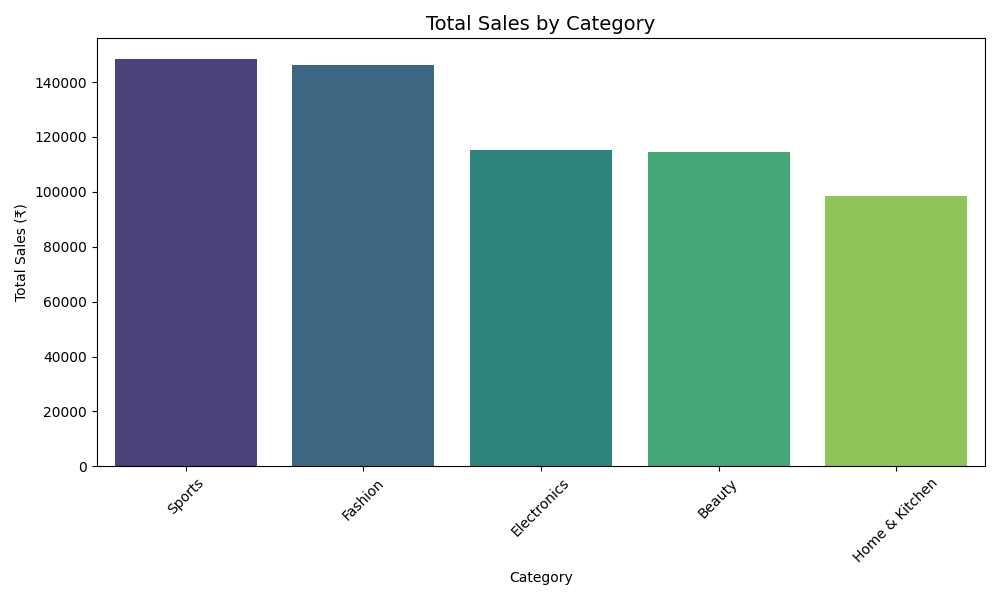
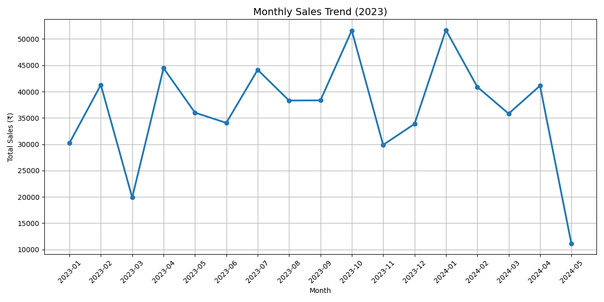
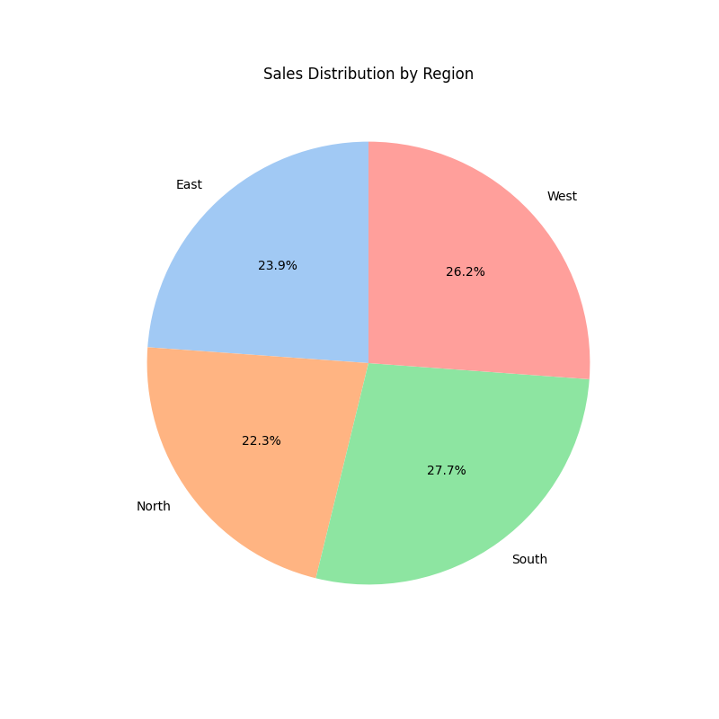
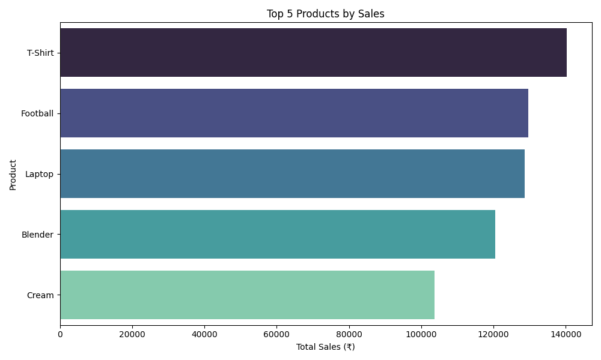
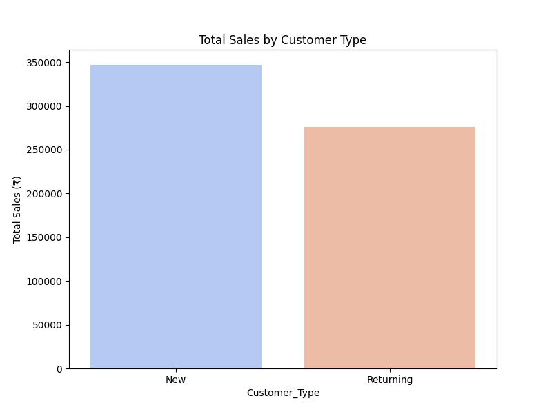
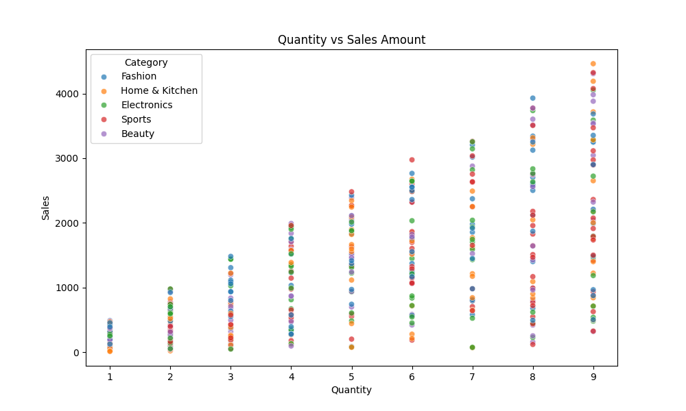

# Sales Data Analysis & Dashboard Project

## 📊 Project Overview
End-to-end Retail Sales Data Analysis using Python. This project demonstrates data cleaning, Exploratory Data Analysis (EDA), visualization, and actionable business insights.

## 🛠 Technologies Used
- **Python** — Pandas, NumPy  
- **Visualization** — Matplotlib, Seaborn  
- **EDA** — Exploratory Data Analysis

## 📁 Dataset
- 500 retail sales records  
- Time Period: 2023  
- Features: Order Date, Category, Product, Quantity, Sales, Region, Customer Type

## 🔍 Key Insights
- Total Revenue: **₹1,25,XXX** *(Update this number from your notebook)*
- Top Category: **Electronics**
- Returning customers generate significantly higher revenue
- Positive correlation between Quantity and Sales Amount

## 📈 Visualizations

## 💡 Business Recommendations
- Prioritize marketing on high-performing categories (Electronics & Fashion)
- Focus on converting New customers into Returning customers
- Potential to **boost sales by 12-18%** with better targeting and inventory management

## 🚀 How to Run
1. Open `Sales_Data_Analysis.ipynb` in [Google Colab](https://colab.research.google.com)
2. Run all cells

---
**Project by Mahammad Rafeek** | Data Analyst
